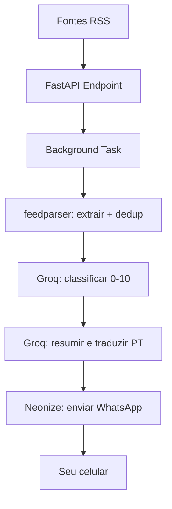

# 🤖 News Monitor — Digest de IA no WhatsApp


Bot pessoal que coleta notícias de IA em fontes RSS, resume e traduz para português com IA (Groq) e entrega digests no WhatsApp 4x ao dia. Só chega o que importa — com o link do artigo oficial.

## 💬 Exemplo de mensagem

```text
🗞️ *Digest IA*
_Manchetes de IA resumidas em português — 3 novidades_

*1. Groq adiciona suporte a LoRA fine-tune no LPU*
• Ajuste eficiente de modelos grandes em produção.
• Reduz custo e tempo de adaptação sem re-treinar tudo.
_Por que importa:_ adaptar modelos rápido e barato.
🔗 https://groq.com/blog/exemplo-lora
───────────────
*2. ...*

_Enviado pelo teu bot de IA 🤖_
```

No app, `*negrito*` e `_itálico_` renderizam formatados (os marcadores somem).

## 🏗️ Arquitetura



| Peça | Papel |
|---|---|
| **Neonize** | WhatsApp via `whatsmeow` (Go), sessão persistente em SQLite |
| **FastAPI** | Endpoints + `BackgroundTasks` + APScheduler (08h, 13h, 19h, 23h WAT) |
| **Groq** | Filtro de relevância (0–10) + resumo/tradução (`openai/gpt-oss-20b`) |

**Regra de relevância:** 8–10 → envia na hora · 5–7 → digest agrupado · 0–4 → descartado. Uma mensagem longa em vez de rajadas (anti-spam).

## 📰 Fontes (verificadas ao vivo)

Oficiais: OpenAI News, HuggingFace Blog, Google AI Blog · Agregadores: TechCrunch AI, Hacker News, r/singularity. A lista vive em `feeds.py`. (Anthropic e Groq não têm RSS oficial — entram via agregadores.)

## 🚀 Quickstart local

```powershell
py -m venv .venv
.\.venv\Scripts\Activate.ps1
pip install -r requirements.txt
Copy-Item .env.example .env   # preencher GROQ_API_KEY e MY_PHONE
python -m uvicorn main:app --port 8000
```

Primeira vez: escaneie o QR no terminal — ou use `POST /whatsapp/pair-code` e digite o código em *WhatsApp > Dispositivos conectados > Conectar com número*. Depois o login é automático (`whatsapp.db`).

## 🔌 Endpoints

| Método | Rota | Para quê |
|---|---|---|
| GET | `/health` | status + scheduler + WhatsApp |
| GET | `/feeds` | lista de fontes |
| POST | `/trigger` | coleta em background (cron externo) |
| POST | `/trigger-now` | coleta imediata (bloqueante, p/ teste) |
| POST | `/pause` · `/resume` | pausa/retoma scheduler |
| GET | `/whatsapp/status` | sessão (conectado, logado) |
| POST | `/whatsapp/pair-code` | código de pareamento `{"phone": "..."}` |
| POST | `/whatsapp/send` | envio manual `{"text": "..."}` |

## ⚙️ Configuração (`.env`)

| Var | Default | Descrição |
|---|---|---|
| `GROQ_API_KEY` | — | chave do console Groq (obrigatória) |
| `GROQ_MODEL` | `openai/gpt-oss-20b` | modelo principal |
| `GROQ_FALLBACK_MODEL` | `llama-3.3-70b-specdec` | fallback |
| `MY_PHONE` | — | só dígitos com DDI (ex. `244955324708`) |
| `TIMEZONE` / `DIGEST_HOURS` | `Africa/Luanda` / `8,13,19,23` | agenda |
| `SCORE_SEND_NOW` / `SCORE_DIGEST_MIN` | `8` / `5` | limiares |
| `MAX_ITEMS_PER_RUN` / `MAX_DIGEST_ITEMS` | `15` / `5` | tetos anti-spam |

## ☁️ Deploy grátis (Render + cron-job.org)

1. Push no GitHub → Render → New Web Service → plano **Free**; build `pip install -r requirements.txt`, start `uvicorn main:app --host 0.0.0.0 --port $PORT`; secrets (`GROQ_API_KEY`, `MY_PHONE`) no dashboard, nunca no código.
2. `POST /whatsapp/pair-code` → código nos logs → parear no celular.
3. cron-job.org: 1 job `GET /health` a cada 10 min (impede o sleep + disco efémero sobrevive) + 4 jobs `POST /trigger` às 08/13/19/23 `Africa/Luanda`.
4. Limites do grátis: sem disco persistente (cada restart = re-parear + lote catch-up único), 750h/mês. O endpoint recusa pipeline se `logged_in == false` (não queima Groq à toa).

## 🗂️ Estrutura

```text
main.py             FastAPI + APScheduler + endpoints
config.py           env (.env)
feeds.py            lista de RSS
processor.py        RSS → dedup → Groq → formato WhatsApp
groq_service.py     classificar + resumir/traduzir
whatsapp_service.py Neonize (ClientFactory, loop em background, JID)
```

## ⚠️ Aviso

Usa a API não-oficial do WhatsApp (via conta própria) — para uso pessoal é tranquilo, mas existe risco teórico de bloqueio em caso de spam. Este bot foi desenhado para ficar muito abaixo dos limites (poucas mensagens/dia, sem rajadas).

## 📄 Licença

MIT — veja `LICENSE`.
